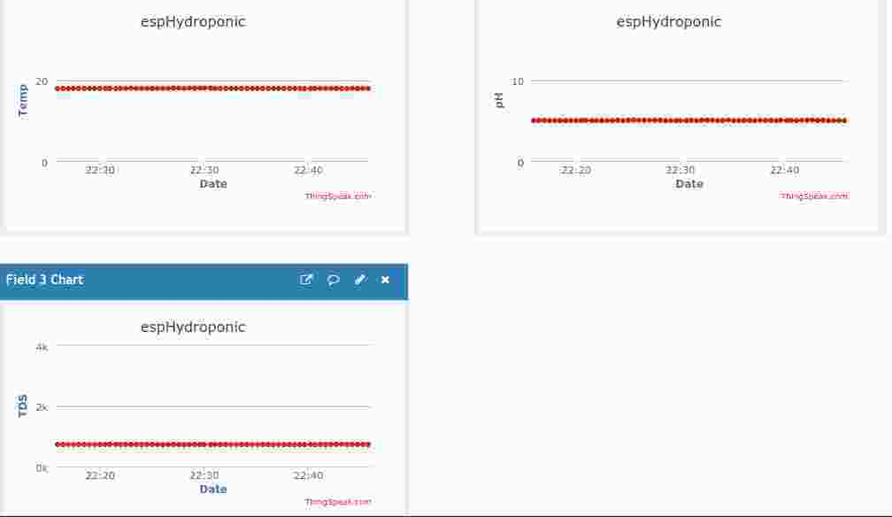
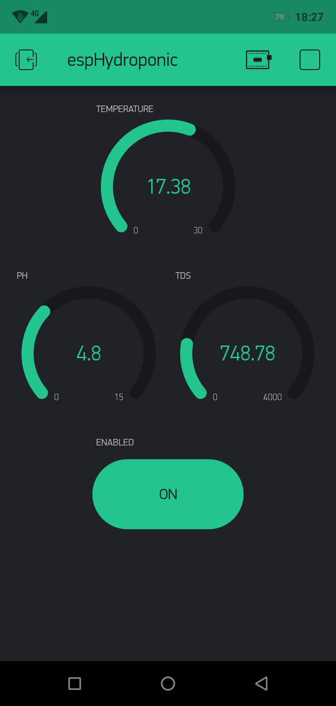
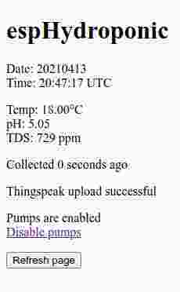

# ardHydroponic

An Arduino Mega managing a hydroponic plant bed.  

Visualization on an LCD screen  
Managed and configured with push buttons  
Data uploaded to Blynk app and ThingSpeak  
Monitored on a webpage

## Hardware

Things marked as optional are used when you make a PCB and/or an ESP-01 module.  

1 x Arduino Mega 2560, [AliExpress](https://www.aliexpress.com/wholesale?SearchText=arduino+mega+2560)  

1 x LCD display, 4x20 with I2C communication, [AliExpress](https://www.aliexpress.com/wholesale?SearchText=lcd+4x20+i2c)  

1 x ESP-01 module, [AliExpress](https://www.aliexpress.com/wholesale?SearchText=esp-01) (optional)  

5 x Momentary push button [AliExpress](https://www.aliexpress.com/wholesale?SearchText=switch+dip+6mm)  

5 x MOSFET module, [AliExpress](https://www.aliexpress.com/wholesale?SearchText=mosfet+module+irf520)  

4 x pump, [AliExpress](https://www.aliexpress.com/wholesale?SearchText=peristaltic+pump)  

1 x magnetic stirrer, [DIY suggestion](https://www.instructables.com/How-to-Make-a-Cheap-Portable-Magnetic-Stirrer/)  

1 x EC/TDS sensor, [AliExpress](https://www.aliexpress.com/wholesale?SearchText=dfrobot+gravity+tds)  

1 x pH sensor, [AliExpress](https://www.aliexpress.com/wholesale?SearchText=dfrobot+gravity+ph)  

1 x DS18B20 temperature sensor, [AliExpress](https://www.aliexpress.com/wholesale?SearchText=ds18b20)  

1 x KY-019 relay module, [AliExpress](https://www.aliexpress.com/wholesale?SearchText=ky-019) (optional)  

5 x 10 kohm resistor  

1 x 4.7 kohm resistor  

1 x 1 kohm resistor (optional)  

1 x 2.2 kohm resistor (optional)  

1 x 2 pole screw terminal block, 5.0mm leg space [AliExpress](https://www.aliexpress.com/wholesale?SearchText=screw+terminal+block+5.0+mm) (optional)  

1 x 3 pole screw terminal block, 5.0mm leg space [AliExpress](https://www.aliexpress.com/wholesale?SearchText=screw+terminal+block+5.0+mm) (optional)  

1 x 5 pole screw terminal block, 5.0mm leg space [AliExpress](https://www.aliexpress.com/wholesale?SearchText=screw+terminal+block+5.0+mm) (optional)  

1 x 6 pole screw terminal block, 5.0mm leg space [AliExpress](https://www.aliexpress.com/wholesale?SearchText=screw+terminal+block+5.0+mm) (optional)  

1 x 4x2 pin socket header (optional)  

Some single row pin and socket headers, 100mil legs pace (optional)  

1 x DC power source, same voltage as your pumps. If this will also feed the Arduino board, not higher than 12V  

A PCB like the one in [this gerber zip](KiCAD/ardHydroponic/Gerber/ardHydroponic.zip) (optional)  

Connect anf build everything according to the [schematics](KiCAD/ardHydroponic/ardHydroponic.pdf) in KiCAD.  

Calibration fluids:  
pH: two solutions with known values, for example 4.00 and 7.00  (other values will also work)  
TDS: solution with known TDS value  

## Usage

Your setup will have five push buttons and one LCD display.  
Everything is monitored and adjusted from the LCD.  
A lot of output is also provided on the serial output from the Mega.  

### Modes

There are four major modes of the system:  

* Running...  
* Maintenance  
* Settings  
* Special  

Also there is a 'Reading...' mode that the system enters when measuring in 'Running...' mode, and an 'Uploading...' mode when uploading data to internet.  

You advance from one mode to the next by pushing and holding down 'Button 1' for one second.  
When you do this in 'Special' mode you loop back to 'Running...' mode again.  

### 'Running...' mode

Button number:  

1. Enter next mode  
   * Long press: enter next mode  
2. No function  
3. No function  
4. No function  
5. No function  

LCD shows measured values, and whether they're too low or too high  

### 'Maintenance' mode

Button number:  

1. Enter next mode/Toggle output
   * Long press: enter next mode  
   * Short press: start or stop the indicated output  
2. Select previous output
3. Select next output
4. No function
5. No function

LCD shows selected output  

### 'Settings' mode

Button number:  

1. Enter next mode/Save variable  
   * Long press: leave this mode and enter next  
   * Short press: save variable to EEPROM  
2. Select previous variable
3. Select next variable
4. Step down selected variable
5. Step up selected variable

There are seventeen variables available:

* Nutr pump time,   ms
* pH+ pump time,    ms
* pH- pump time,    ms
* Clean pumps time, ms
* Iteration time,   ms
* Stir time,        ms
* Stir interval,    ms
* pH low,           pH
* pH high,          pH
* TDS low,         ppm
* k value,    constant
* TDS factor, constant
* Neutral pH,       pH
* Acid pH,          pH
* Neutral voltage,  mV
* Acid voltage,     mV
* pH voltage offs., mV

The names are pretty self explanatory.  
However, the last seven of these will be further explained in the calibration section below.  

The second line on the LCD will show the variable name.  
Line three will show the value stored in EEPROM.  
Line four will show the new value you step up and down.  

Also lines three and four will show pH and TDS when applicable.  

There is some sanity checking done of these variables when changing them via the LCD, but beware of what you tap in.  
### 'Special' mode

Button number:  

1. Enter next mode/Run action  
   * Long press: leave this mode and enter next  
   * Short press: Run selected action  
2. Select previous action
3. Select next action
4. No function
5. No function

LCD shows selected action and action result  

#### Actions

* Interact with ESP module in serial monitor
* Clear EEPROM. On next restart the EEPROM will be rewritten with the default values from config
* Reset ESP module
* Reset whole system
* Toggle the serial debugging output. Will go back to the setting in config.h after a restart.
* Print the IP of the ESP module
* Print MAC address of the ESP module

## Calibration

### TDS value

Put the TDS sensor in a solution with a know TDS value.  

Enter 'Settings' mode.

Select the 'TDS factor' variable using 'Button 2' and 'Button 3'.  
Enter the TDS factor of your known solution using 'Button 4' and 'Button 5'.  
The TDS value on the left of the screen will be updated whenever you push those buttons.  
Save the new 'TDS factor' with a short press on 'Button 1'.  

Select the 'k value' variable using 'Button 2' and 'Button 3'.  
Step up and down 'k value' using 'Button 4' and 'Button 5'.  
The TDS value on the left of the screen will be updated whenever you push those buttons.  
When the TDS value shown on screen correlates with your known solution save the 'k value' with a short press on 'Button 1'.  

### pH value

Enter 'Settings' mode.  

Select the 'Neutral pH' variable using 'Button 2' and 'Button 3'.  
Enter the pH value of your known solution, ie the one with the higher pH, using 'Button 4' and 'Button 5'.  
Save the new value with a short press on 'Button 1'.  

Select the 'Acid pH' variable using 'Button 2' and 'Button 3'.  
Enter the pH value of your known solution, ie the one with the lower pH, using 'Button 4' and 'Button 5'.  
Save the new value with a short press on 'Button 1'.  

Put your pH sensor in the neutral solution.  
Select the 'Neutral voltage' variable using 'Button 2' and 'Button 3'.  
On the lower right of the screen you will now see the measured voltage from the pH sensor in millivolts. You can't change that. However, pressing 'Button 4' or 'Button 5' will update that measurement.  
When you get a solid reading, save the value with a short press on 'Button 1'.  

Put your pH sensor in the acid solution.  
Select the 'Acid voltage' variable using 'Button 2' and 'Button 3'.  
On the lower right of the screen you will now see the measured voltage from the pH sensor in millivolts. You can't change that. However, pressing 'Button 4' or 'Button 5' will update that measurement.  
When you get a solid reading, save the value with a short press on 'Button 1'.  

There is also a 'pH voltage offset' for further trimming.  

## Web interface

A simple web page shows last data read and ThingSpeak upload status.  

You can also disable an enable the outputs relay from the page.

You can find the IP address of the web server using the 'Special' mode.  

## Blynk app

The app shows latest values of the sensors.  

Also you can control the outputs relay from it.  

## Software configuration

All configuration is made in 'config.h'

The most interesting variables are:

### varNames

If you want it in your own language, change it here.  
Other LCD output is mostly found in 'LCD.h', but also in some other places. Sorry...  

### vars

These are the start values of the variables that can be edited from the LCD.  
If you change these after having having uploaded the sketch once, it will not be used since these are now read from EEPROM.  

### incs

The increments/decrements of the variables above.  
(How big should the jumps be when using buttons 'Button 4' and 'Button5'.)  

## Libraries and boards in Arduino IDE

Most can be installed from within the Arduino IDE, but look out for the liquid crystal library so you don't install the wrong one.  
Read below!  

### ESP8266 board library

Add [http://arduino.esp8266.com/stable/package_esp8266com_index.json](http://arduino.esp8266.com/stable/package_esp8266com_index.json) (as a text line), in Files->Preferences->Additional Boards Manager URLs:  

Then go to Tools->Board:...->Boards Manager...,search for esp8266 and install it.  

### LiquidCrystal_I2C

Don't install the LiquidCrystal_I2C library with Arduino IDE's library manager.  

Instead use the one from [https://github.com/fdebrabander/Arduino-LiquidCrystal-I2C-library](https://github.com/fdebrabander/Arduino-LiquidCrystal-I2C-library).  

### FTDebouncer

[https://github.com/ubidefeo/FTDebouncer](https://github.com/ubidefeo/FTDebouncer)  

### Blynk

[https://github.com/blynkkk/blynk-library](https://github.com/blynkkk/blynk-library)  

### ThingSpeak

[https://github.com/iobridge/thingspeak](https://github.com/iobridge/thingspeak)  

### NTPClient

[https://github.com/arduino-libraries/NTPClient](https://github.com/arduino-libraries/NTPClient)  

## Install and configure

### Create accounts for online visualizations

#### thingspeak

Get an account at [thingspeak.com](https://thingspeak.com).

Create a new channel with the fields:

* Field1: Temp
* Field2: pH
* Field3: TDS

Take note of your channel ID and write API key.  

#### blynk

Download [Blynk](https://play.google.com/store/apps/details?id=cc.blynk) to your phone.  

Open Blynk and create a new project.  

Add widget boxes:  

* Gauge, Temperature, Input: Virtual V0, scaled 0-30
* Gauge, pH, Input: Virtual V1, scaled 0-15
* Gauge, TDS, Input Virtual V2, scaled 0-4000
* Button, Enabled, Mode: Switch, Output: Virtual V3

In your mail you will have received the authorization token.  

### Arduino Mega

Compile and upload ardHydroponic/ardHydroponic.ino with, for example, Arduino IDE.  

When uploading over USB you must open up the connection between D14 and RESET, ie remove the jumper JP1.

### ESP-01

Rename/copy espHydroponic/secrets.h.template to espHydroponic/secrets.h, and edit it with your own values/keys.  

Compile and upload espHydroponic/espHydroponic.ino with, for example, Arduino IDE.  

## Trouble shooting

### Resetting EEPROM to default values at every start

Edit ardHydroponic.ino  

Uncomment the line  

    //clearEEPROM();

and upload sketch.  

## Misc

### Useful programs

#### cu

A simple serial monitor  

Get serial output  
>$ cu -l /dev/ttyACM0 -s 9600

Exit with ~. (tilde dot)  

#### picocom

A more versatile serial monitor  

Get serial output  
>$ picocom -b 115200 /dev/ttyACM0 --omap crcrlf

Exit with Ctrl+a Ctrl+x  

### Links

EC sensor:  
[https://wiki.dfrobot.com/Gravity__Analog_TDS_Sensor___Meter_For_Arduino_SKU__SEN0244](https://wiki.dfrobot.com/Gravity__Analog_TDS_Sensor___Meter_For_Arduino_SKU__SEN0244)  

pH sensor:  
[https://wiki.dfrobot.com/Gravity__Analog_pH_Sensor_Meter_Kit_V2_SKU_SEN0161-V2](https://wiki.dfrobot.com/Gravity__Analog_pH_Sensor_Meter_Kit_V2_SKU_SEN0161-V2)  

### Screen shots

  
  
  
